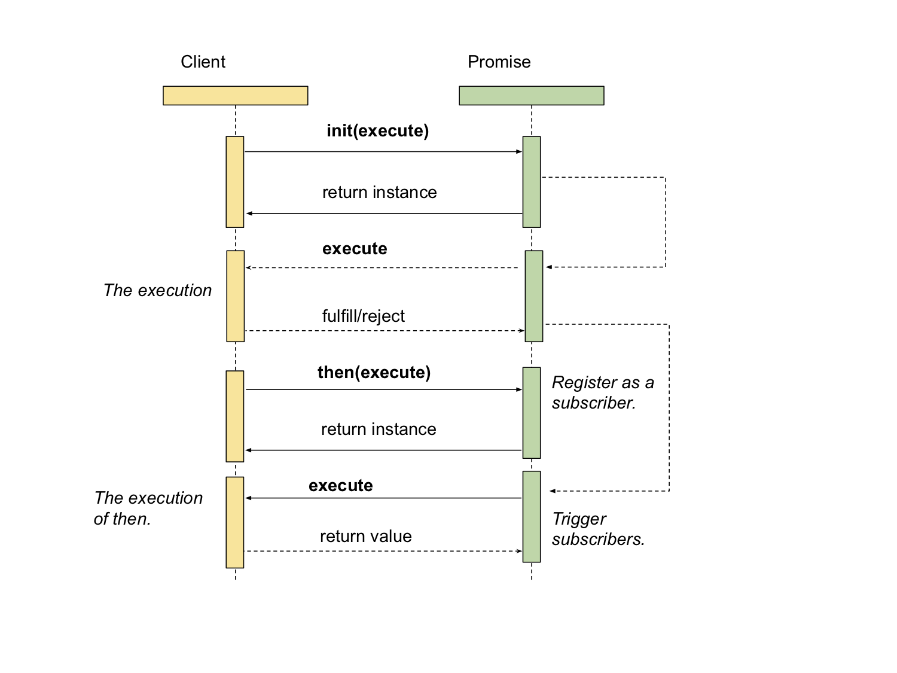

# WHPromise
[](https://github.com/chronicqazxc/WHPromise)
[](https://github.com/chronicqazxc/WHPromise)
[](https://github.com/chronicqazxc/WHPromise)

## Light weight Promise (Future) framework in iOS.

## How to use.
Crate a promise instance with async task.
```swift
func loginBy(credential: Credential) -> Promise<Profile> {
    let promise = Promise<Profile> { (fulfill, reject) in
        Service.shared.getProfileBy(credential: credential) {
            if success {
                fulfill(profile)
            } else {
                reject(error)
            }
        }
    }
    return promise
}

promise.then({ profile in
// Process with profile.
}).catch({ (error)
// Error handling.
})
```
Crate a promise instance with a value.
```swift
let promise = Promise<Int>(value: someInt)
promise.then({ result in
// Process the int value.
}).catch({ (error)
// Error handling.
})
```
Crate an error promise instance. 
```swift
let promise = Promise<Int>(error: someError)
promise.then({ result in
// Process the int value.
}).catch({ (error)
// Error handling.
})
```
Then with async task. 
```swift
let promise = Promise<Int>(value: someInt)
promise.then({ (result, complete: @escaping (GroceryProduct)->Void) in
    let json = string.data(using: .utf8)
    let decoder = JSONDecoder()
    let products = try decoder.decode(GroceryProduct.self, from: json!)
    asyncTask {
        complete(products)
    }
})
```

## Sequence diagram.


## Author:
[Wayne Hsiao](mailto:chronicqazxc@gmail.com)
