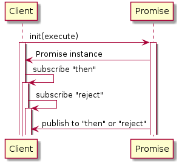

# WHPromise
[](https://github.com/chronicqazxc/WHPromise)
[](https://github.com/chronicqazxc/WHPromise)
[](https://github.com/chronicqazxc/WHPromise)

## Light weight Promise (Future) framework in iOS.

## How to use.
### Case 1. JSON Parser promise
```swift
    func jsonParser<Type: Codable>(data: Data) -> Promise<Type> {
        let promise = Promise<Type> { (fulfill, reject) in
            do {
                let decoder = JSONDecoder()
                let products = try decoder.decode(Type.self, from: data)
                fulfill(products)
            } catch {
                reject(error)
            }
        }
        return promise
    }
```
### Case 2. Get product type from order id
```swift
    func getProductFromOrder(orderId: String) -> Promise<GroceryProduct> {
        let promise = Promise<GroceryProduct> { (fulfill, reject) in
            DispatchQueue.global().async {
                let string = """
                    {"name": "Banana",
                       "points": 200,
                       "description": "A banana grown in Ecuador."
                    }
                """
                let jsonData = string.data(using: .utf8)
                let jsonPromise = self.jsonParser(data: jsonData!) as Promise<GroceryProduct>
                jsonPromise.then { product in
                    fulfill(product)
                }.catch { error in
                    reject(error)
                }
            }
        }
        return promise
    }
```
### Case 3. Get product from orderId
```swift
func testGetProduct() {
        let ex = expectation(description: "")
        let product = getProductFromOrder(orderId: "12345")
        product.then { product in
            ex.fulfill()
            XCTAssertEqual(product.name, "Banana")
            XCTAssertEqual(product.orderId, "12345")
        }.catch { error in
            XCTAssertFalse(false, error.localizedDescription)
        }

        wait(for: [ex], timeout: 10)
    }
```

## Architecture diagram.

## Sequence diagram.


## Author:
[Wayne Hsiao](mailto:chronicqazxc@gmail.com)
